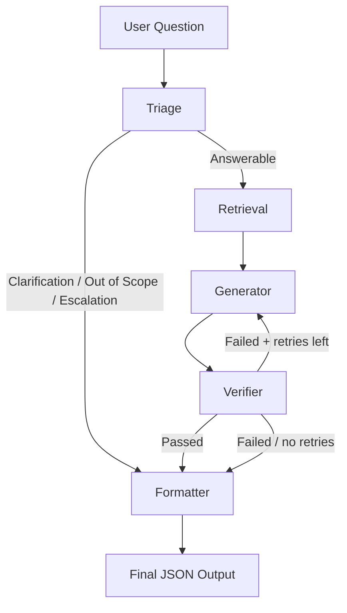

# OrbitDesk AI Support Agent

A production-ready, **fully offline** AI customer support agent for the fictional
SaaS product **OrbitDesk**. The agent answers questions **only** from the
company's local knowledge base — it never behaves like a general-purpose chatbot
and never hallucinates.

Built with:

- **Python 3.11+**
- **LangGraph** (stateful node orchestration)
- **Hugging Face Transformers** (local, offline LLM — Flan-T5)
- **Sentence Transformers** (local embeddings)
- **FAISS** (local vector database)

No OpenAI, Gemini, Claude, or any cloud API. No external search.

---

## How It Works

The system is a pipeline of specialised nodes. A user question flows through
them in order, and each node either handles the question or passes it to the
next.

```
START
  → Triage
      ├─ Answerable            → Retrieval
      ├─ Clarification Required→ Formatter (safe response)
      ├─ Out of Scope          → Formatter (safe refusal)
      └─ Escalation Required   → Formatter (hand off to human)
  → Retrieval (FAISS Top-K)
  → Generator (local LLM, grounded)
  → Verifier
      ├─ Passed                → Formatter
      ├─ Failed (retries left) → Generator (retry once)
      └─ Failed (no retries)   → Formatter (safe failure)
  → Formatter
  → END
```

### 1. Triage Node
Classifies the question into one of four categories: **Answerable**,
**Clarification Required**, **Out of Scope**, or **Escalation Required**. Uses
deterministic keyword rules plus a semantic similarity check against known
OrbitDesk topics. Only "Answerable" questions proceed to retrieval.

### 2. Retrieval Node
Converts the question into an embedding and searches the local **FAISS** index
for the **Top-K** most relevant documents. Returns both content and metadata.
Because the index is built *only* from the local knowledge base, it can never
retrieve unrelated documents.

### 3. Generator Node
Builds a **grounded prompt** from the retrieved documents and the user question,
then calls the local Hugging Face model. The prompt enforces "answer ONLY from
context; never use outside knowledge." If the answer isn't in the context, it
explicitly says so.

### 4. Verifier Node
Checks that every important claim in the answer is supported by the retrieved
documents, that no unsupported information was added, and that the answer is
consistent with the docs. If verification fails, the graph regenerates the
answer **once**. If it still fails, a safe failure response is returned instead
of a guess.

### 5. Formatter Node
Shapes the final state into the schema-conforming JSON output, computing
confidence level and final status.

## Runtime Flow (Mermaid)



---

## Example

```json
{
  "question": "Can a read-only user create API credentials?",
  "answer": "No. Only Owners and Admins can create workspace API credentials.",
  "sources": ["05_api_credentials.md", "02_roles_and_permissions.md"],
  "verification": "Passed",
  "confidence": "High",
  "status": "Success"
}
```

---

## Installation

Make sure you have **Python 3.11+**.

```bash
cd AI-Support-Agent

# 1. Create and activate a virtual environment
python -m venv venv
venv\Scripts\activate        # Windows
source venv/bin/activate     # macOS / Linux

# 2. Install dependencies
pip install -r requirements.txt
```

> **First run note:** the models are downloaded once from the Hugging Face Hub
> and cached locally. After that, the system runs fully offline.

---

## Usage

### Single question

```bash
python app.py --question "Can a read-only user create API credentials?"
```

### Sample questions

```bash
python app.py --sample
```

### Interactive mode

```bash
python app.py --interactive
```

### Plain prompt

```bash
python app.py
```

---

## Project Structure

```
AI-Support-Agent/
├── app.py                  # CLI entry point
├── config.py               # Central configuration
├── state.py                # LangGraph state + data structures
├── graph.py                # LangGraph orchestration
├── output_schema.json      # Expected output shape
├── requirements.txt        # Dependencies
├── README.md               # This file
├── knowledge_base/         # Local Markdown documentation
├── resolved_cases.json     # Resolved support cases (retrieval context)
├── sample_questions.json   # Seed questions for --sample
├── logs/                   # Runtime logs
├── models/
│   └── llm.py              # Local Hugging Face LLM wrapper
├── nodes/
│   ├── triage.py           # Classification node
│   ├── retrieval.py        # FAISS retrieval node
│   ├── generator.py        # Answer generation node
│   ├── verifier.py         # Answer verification node
│   └── formatter.py        # Output formatting node
└── utils/
    ├── logger.py           # Centralised logging
    ├── loader.py           # Knowledge base loading
    ├── embeddings.py       # Sentence embedding wrapper
    ├── vector_store.py     # FAISS index + search
    └── prompts.py          # Prompt templates
```

---

## Why This Architecture?

- **No hallucination** — the LLM is chained to retrieved evidence.
- **Grounding** — every answer is traceable to real source files.
- **Offline & private** — customer data never leaves the machine.
- **Safe** — out-of-scope and unclear questions are handled explicitly.
- **Reliable** — the verifier catches mistakes and forces a retry or a safe
  refusal.
- **Introspectable** — triage, verification, confidence, and status are all
  exposed in the output.

---

## Tests

Run the test suite with:

```bash
pytest tests/ -v
```

---

## License

For demonstration and educational purposes only.
